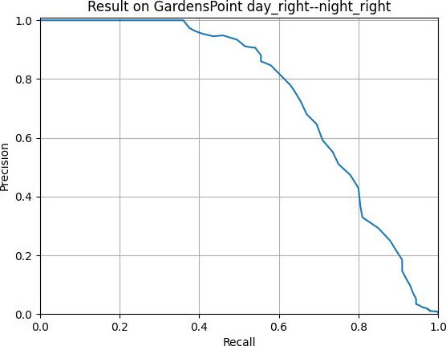
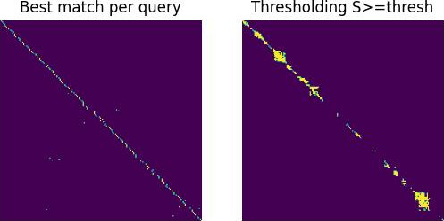
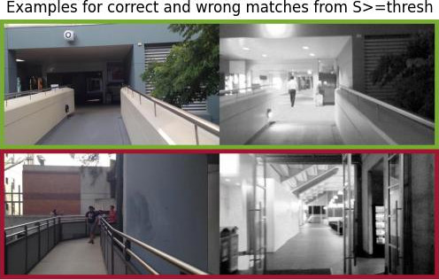

# Visual Place Recognition: A Tutorial
Work in progress: This repository provides the example code from <a href="https://doi.org/10.1109/MRA.2023.3310859">our paper "Visual Place Recognition: A Tutorial"</a>.
The code performs VPR on the GardensPoint day_right--night_right dataset. Output is a plotted pr-curve, matching decisions, two examples for a true-positive and a false-positive matching, and the AUC performance, as shown below.

If you use our work for your academic research, please refer to the following paper:
```bibtex
@article{SchubertRAM2023ICRA2024,
  title={Visual Place Recognition: A Tutorial},
  author={Schubert, Stefan and Neubert, Peer and Garg, Sourav and Milford, Michael and Fischer, Tobias},
  journal={IEEE Robotics \& Automation Magazine},  
  year={2023},
  doi={10.1109/MRA.2023.3310859}
}
```


## How to run the code
### Online (Using GitHub Codespaces)

This repository is configured for use with [GitHub Codespaces](https://github.com/features/codespaces), a service that provides you with a fully-configured Visual Studio Code environment in the cloud, directly from your GitHub repository.

To open this repository in a Codespace:

1. Click on the green "Code" button near the top-right corner of the repository page.
2. In the dropdown, select "Open with Codespaces", and then click on "+ New codespace".
3. Your Codespace will be created and will start automatically. This process may take a few minutes.

Once your Codespace is ready, it will open in a new browser tab. This is a full-featured version of VS Code running in your browser, and it has access to all the files in your repository and all the tools installed in your Docker container.

You can run commands in the terminal, edit files, debug code, commit changes, and do anything else you would normally do in VS Code. When you're done, you can close the browser tab, and your Codespace will automatically stop after a period of inactivity.

### Local
```
python3 demo.py
```
The GardensPoints Walking dataset will be downloaded automatically. You should get an output similar to this:
```
python3 demo.py
===== Load dataset
===== Load dataset GardensPoint day_right--night_right
===== Compute local DELF descriptors
===== Compute holistic HDC-DELF descriptors
===== Compute cosine similarities S
===== Match images
===== Evaluation

===== AUC (area under curve): 0.74
===== R@100P (maximum recall at 100% precision): 0.36
===== recall@K (R@K) -- R@1: 0.85 , R@5: 0.925 , R@10: 0.945
```

| Precision-recall curve | Matchings M | Examples for a true positive and a false positive |
|:-------------------------:|:-------------------------:|:-------------------------:|
|  |   | | 


## Requirements
The code was tested with the library versions listed in [requirements.txt](./requirements.txt). Note that Tensorflow or PyTorch is only required if the corresponding image descriptor is used. If you use pip, simply:
```bash
pip install -r requirements.txt
```

You can create a conda environment containing these libraries as follows (or use the provided [environment.yml](./.devcontainer/environment.yml)):
```bash
mamba create -n vprtutorial python numpy pytorch torchvision natsort tqdm opencv pillow scikit-learn faiss matplotlib-base tensorflow tensorflow-hub tqdm scikit-image patchnetvlad -c conda-forge
```


## List of existing open-source implementations for VPR (work in progress)
[//]: # (use <td colspan=3> or rowspan to combine cells)


### Descriptors
#### Holistic descriptors
<table>
    <tbody>
        <tr>
            <td><a href="">AlexNet</a></td>
            <td><a href="https://github.com/BVLC/caffe/tree/master/models/bvlc_alexnet">code</a>*</td>
            <td><a href="https://doi.org/10.1109/IROS.2015.7353986">paper</a></td>
        </tr>
        <tr>
            <td><a href="">AMOSNet</a></td>
            <td><a href="https://github.com/scutzetao/DLfeature_PlaceRecog_icra2017">code</a></td>
            <td><a href="https://doi.org/10.1109/ICRA.2017.7989366">paper</a></td>
        </tr>
        <tr>
            <td><a href="">DELG</a></td>
            <td><a href="https://github.com/tensorflow/models/tree/master/research/delf">code</a></td>
            <td><a href="https://doi.org/10.1007/978-3-030-58565-5_43">paper</a></td>
        </tr>
        <tr>
            <td><a href="">DenseVLAD</a></td>
            <td><a href="http://www.ok.ctrl.titech.ac.jp/~torii/project/247/">code</a></td>
            <td><a href="https://doi.org/10.1109/CVPR.2015.7298790">paper</a></td>
        </tr>
        <tr>
            <td><a href="">HDC-DELF</a></td>
            <td><a href="https://www.tu-chemnitz.de/etit/proaut/hdc_desc">code</a></td>
            <td><a href="https://openaccess.thecvf.com/content/CVPR2021/html/Neubert_Hyperdimensional_Computing_as_a_Framework_for_Systematic_Aggregation_of_Image_CVPR_2021_paper.html">paper</a></td>
        </tr>
        <tr>
            <td><a href="">HybridNet</a></td>
            <td><a href="https://github.com/scutzetao/DLfeature_PlaceRecog_icra2017">code</a></td>
            <td><a href="https://doi.org/10.1109/ICRA.2017.7989366">paper</a></td>
        </tr>
        <tr>
            <td><a href="">NetVLAD</a></td>
            <td><a href="https://www.di.ens.fr/willow/research/netvlad/">code</a></td>
            <td><a href="https://doi.org/10.1109/CVPR.2016.572">paper</a></td>
        </tr>
        <tr>
            <td><a href="">CosPlace</a></td>
            <td><a href="https://github.com/gmberton/CosPlace">code</a></td>
            <td><a href="https://arxiv.org/abs/2204.02287">paper</a></td>
        </tr>
        <tr>
            <td><a href="">EigenPlaces</a></td>
            <td><a href="https://github.com/gmberton/EigenPlaces">code</a></td>
            <td><a href="https://arxiv.org/abs/2308.10832">paper</a></td>
        </tr>
    </tbody>
</table>


#### Local descriptors
<table>
    <tbody>
        <tr>
            <td><a href="">D2-Net</a></td>
            <td><a href="https://github.com/mihaidusmanu/d2-net">code</a></td>
            <td><a href="https://doi.org/10.1109/CVPR.2019.00828">paper</a></td>
        </tr>
        <tr>
            <td><a href="">DELF</a></td>
            <td><a href="https://github.com/tensorflow/models/tree/master/research/delf">code</a></td>
            <td><a href="https://doi.org/10.1109/ICCV.2017.374">paper</a></td>
        </tr>
        <tr>
            <td><a href="">LIFT</a></td>
            <td><a href="https://github.com/cvlab-epfl/LIFT">code</a></td>
            <td><a href="https://doi.org/10.1007/978-3-319-46466-4_28">paper</a></td>
        </tr>
        <tr>
            <td><a href="">Patch-NetVLAD</a></td>
            <td><a href="https://github.com/QVPR/Patch-NetVLAD">code</a></td>
            <td><a href="https://openaccess.thecvf.com/content/CVPR2021/html/Hausler_Patch-NetVLAD_Multi-Scale_Fusion_of_Locally-Global_Descriptors_for_Place_Recognition_CVPR_2021_paper.html">paper</a></td>
        </tr>
        <tr>
            <td><a href="">R2D2</a></td>
            <td><a href="https://github.com/naver/r2d2">code</a></td>
            <td><a href="https://papers.nips.cc/paper_files/paper/2019/hash/3198dfd0aef271d22f7bcddd6f12f5cb-Abstract.html">paper</a></td>
        </tr>
        <tr>
            <td><a href="">SuperPoint</a></td>
            <td><a href="https://github.com/magicleap/SuperPointPretrainedNetwork">code</a></td>
            <td><a href="https://doi.org/10.1109/CVPRW.2018.00060">paper</a></td>
        </tr>
    </tbody>
</table>

#### Local descriptor aggregation
<table>
    <tbody>
        <tr>
            <td><a href="">DBoW2</a></td>
            <td><a href="https://github.com/dorian3d/DBoW2">code</a></td>
            <td><a href="https://doi.org/10.1109/TRO.2012.2197158">paper</a></td>
        </tr>
        <tr>
            <td><a href="">HDC (Hyperdimensional Computing)</a></td>
            <td><a href="https://www.tu-chemnitz.de/etit/proaut/hdc_desc">code</a></td>
            <td><a href="https://openaccess.thecvf.com/content/CVPR2021/html/Neubert_Hyperdimensional_Computing_as_a_Framework_for_Systematic_Aggregation_of_Image_CVPR_2021_paper.html">paper</a></td>
        </tr>
        <tr>
            <td><a href="">iBoW (Incremental Bag-of-Words) / OBIndex2</a></td>
            <td><a href="https://github.com/emiliofidalgo/ibow-lcd">code</a></td>
            <td><a href="https://doi.org/10.1109/LRA.2018.2849609">paper</a></td>
        </tr>
        <tr>
            <td><a href="">VLAD (Vector of Locally Aggregated Descriptors)</a></td>
            <td><a href="http://www.vlfeat.org/">code</a>*</td>
            <td><a href="https://doi.org/10.1109/CVPR.2010.5540039">paper</a></td>
        </tr>
    </tbody>
</table>

### Sequence methods
<table>
    <tbody>
        <tr>
            <td><a href="">Delta Descriptors</a></td>
            <td><a href="https://github.com/oravus/DeltaDescriptors">code</a></td>
            <td><a href="https://doi.org/10.1109/LRA.2020.3005627">paper</a></td>
        </tr>
        <tr>
            <td><a href="">MCN</a></td>
            <td><a href="https://www.tu-chemnitz.de/etit/proaut/en/research/seqloc.html">code</a></td>
            <td><a href="https://doi.org/10.1109/LRA.2019.2927096">paper</a></td>
        </tr>
        <tr>
            <td><a href="">OpenSeqSLAM</a></td>
            <td><a href="https://github.com/OpenSLAM-org/openslam_openseqslam">code</a>*</td>
            <td><a href="https://doi.org/10.1109/ICRA.2012.6224623">paper</a></td>
        </tr>
        <tr>
            <td><a href="">OpenSeqSLAM 2.0</a></td>
            <td><a href="https://github.com/qcr/openseqslam2">code</a></td>
            <td><a href="https://doi.org/10.1109/IROS.2018.8593761">paper</a></td>
        </tr>
        <tr>
            <td><a href="">OPR</a></td>
            <td><a href="https://github.com/PRBonn/online_place_recognition">code</a></td>
            <td><a href="https://doi.org/10.1109/LRA.2015.2512936">paper</a></td>
        </tr>
        <tr>
            <td><a href="">SeqConv</a></td>
            <td><a href="https://www.tu-chemnitz.de/etit/proaut/en/research/prstructure.html">code</a></td>
            <td><a href="http://doi.org/10.15607/RSS.2021.XVII.091">paper</a></td>
        </tr>
        <tr>
            <td><a href="">SeqNet</a></td>
            <td><a href="https://github.com/oravus/seqNet">code</a></td>
            <td><a href="https://doi.org/10.1109/LRA.2021.3067633">paper</a></td>
        </tr>
        <tr>
            <td><a href="">SeqVLAD</a></td>
            <td><a href="https://github.com/vandal-vpr/vg-transformers">code</a></td>
            <td><a href="https://doi.org/10.1109/LRA.2022.3194310">paper</a></td>
        </tr>
        <tr>
            <td><a href="">VPR</a></td>
            <td><a href="https://github.com/PRBonn/vpr_relocalization">code</a></td>
            <td><a href="https://www.ipb.uni-bonn.de/wp-content/papercite-data/pdf/vysotska2017irosws.pdf.">paper</a></td>
        </tr>
    </tbody>
</table>

### Misc
<table>
    <tbody>
        <tr>
            <td><a href="">ICM</a></td>
            <td><a href="https://www.tu-chemnitz.de/etit/proaut/en/research/prstructure.html">code</a></td>
            <td><a href="http://doi.org/10.15607/RSS.2021.XVII.091">paper</a></td>
            <td>Graph optimization of the similarity matrix S</td>
        </tr>
        <tr>
            <td><a href="">SuperGlue</a></td>
            <td><a href="https://github.com/magicleap/SuperGluePretrainedNetwork">code</a></td>
            <td><a href="http://doi.org/10.1109/CVPR42600.2020.00499">paper</a></td>
            <td>Local descriptor matching</td>
        </tr>
    </tbody>
</table>

*Third party code. Not provided by the authors. Code implements the author's idea or can be used to implement the authors idea.
